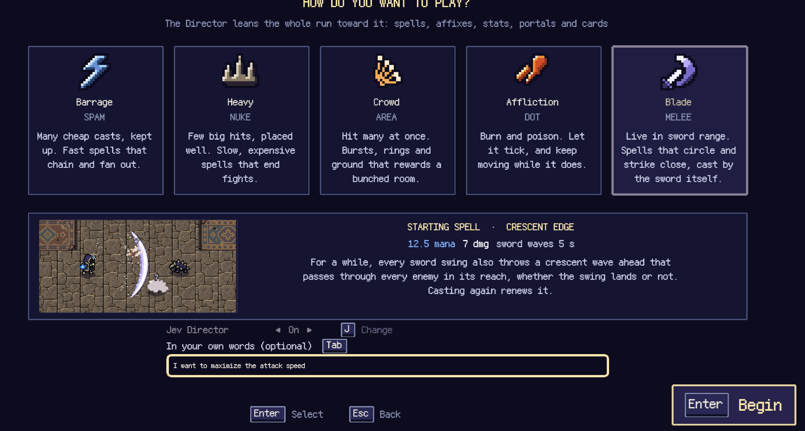
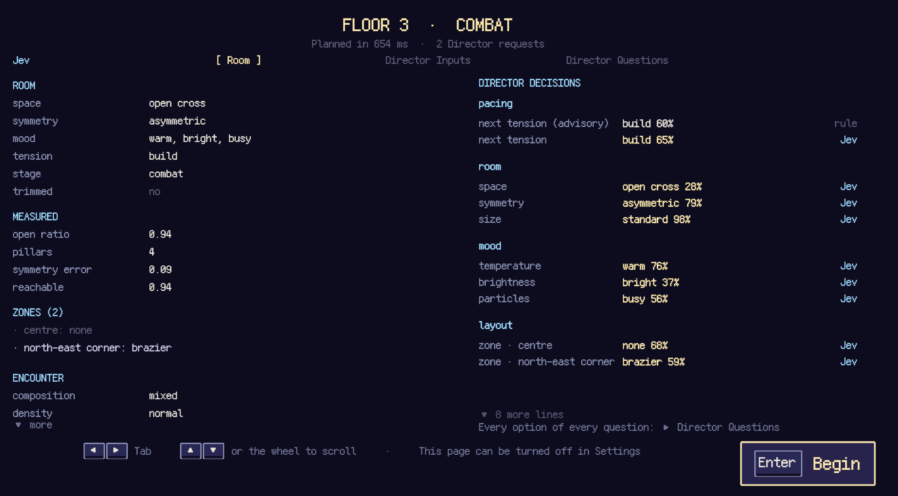
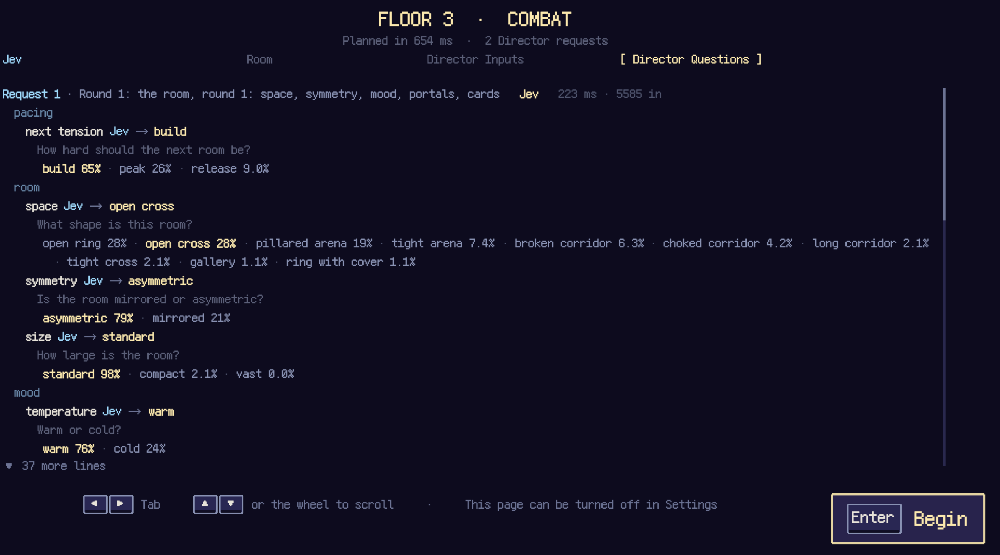

# jev-rogue

[English](README.md) · [简体中文](README.zh-CN.md) · **日本語**

TypeSafe AI の選択モデル [Jev](https://docs.typesafe.ai/) がディレクターを務める、見下ろし型のアクションルームローグライクです。Jev はゲームが用意した**合法な選択肢**のうち、現在のランに合うものを判断します。部屋、敵との遭遇、報酬、戦闘そのものはゲームのコードが生成・実行します。

## スクリーンショット

| プレイスタイルを選ぶ | 部屋のプランを見る | Jev の判断を見る |
|---|---|---|
|  |  |  |

## なぜ Jev を使うのか

AI に人の代わりにゲームをプレイさせることはできます。でも、このプロジェクトが目指す未来はそこではありません。AI が娯楽を引き受け、人だけが働き続けるなら、それは理想よりディストピアに近く感じます。**AI がゲームを作る側に加わり、人が自分で遊ぶ。** そのほうが面白い未来だと考えています。

そこで Jev はプレイヤーの操作を代行せず、ディレクターを務めます。ランの状態を読み、次の部屋、敵との遭遇、報酬について、限られた候補から判断します。コードがその判断を遊べる形にし、プレイヤー自身が探索し、戦い、選び、結果を引き受けます。Jev の選択モデルならプレイヤーの文脈を読みながら、ゲームが安全で実現可能と確認した候補の中だけで答えられます。一人ひとりに応じたランを作りつつ、遊ぶ楽しさと主導権は人に残すことを目指します。

## 中心となる考え方

**パラメーターは Jev が判断し、部屋はアルゴリズムが生成します。** 手続き生成型のローグライクには、マップ、敵編成、報酬を作るコードに加え、生成器へ渡すパラメーターを決める方針があります。後者は通常、重みテーブルや `if` 文で書かれます。このプロジェクトでは Jev モードのとき、その方針のうち**体験上の好み**を判断する部分を Jev に任せ、生成器はそのまま使います。

Jev はプレイヤーが選んだスタイルだけでなく、実際のプレイも読みます。所持する呪文と強化、直近の戦闘、取った報酬と見送った報酬などです。コードは先に合法で公平、かつ予算内の候補だけを提示し、Jev が現在のプレイヤーに合う候補を判断します。コードは返された確率から抽選します。例えば Jev が `open_arena`、非対称な配置、暖かい雰囲気を選びやすいと判断しても、床や遮蔽物を実際に配置するのは部屋の生成器です。生成器は通行可能性と出来上がりを検証し、必要なら再試行や代替の部屋を使います。その後、生成された部屋に合わせて敵編成のパラメーターを決めます。Jev がタイルマップを出力することはありません。

目指すのは、**プレイヤーに応じて変わりながらも、不確実さと手応えを残すラン**です。ビルドを活かせても、毎回有利な部屋や望みどおりの報酬が保証されるわけではありません。数値バランス、安全上の制限、具体的な配置、シード付き乱数はコードが担当します。この分担は[001: ビジョンと範囲](docs/planning/001-vision-and-scope.md)、[002: Jev 統合の原則](docs/planning/002-jev-integration-principles.md)、[004: 部屋生成](docs/planning/004-room-generation.md)に記されています。

## アーキテクチャの概要

```text
ランと戦闘のデータ
  → 現在の状態を要約
  → コードが合法な選択肢を列挙・絞り込み
  → Jev が各選択肢の確率を返す
  → コードがシード付き乱数で抽選
  → コードがプレイ可能な結果を生成・検証
  → 固定ステップで戦闘をシミュレートし、Phaser が描画
```

| モジュール | 役割 |
|---|---|
| [`packages/core`](packages/core) | 純粋な TypeScript による戦闘シミュレーション、部屋と敵編成の生成、呪文、ランの状態、制約、シード付き乱数。DOM と Phaser には依存しません。 |
| [`packages/director`](packages/director) | Jev に渡す状態と質問を組み立て、回答を検証・抽選し、部屋や報酬のプランにします。 |
| [`packages/game`](packages/game) | Phaser の入力・描画、音響、メニュー、ブラウザー側の Jev 呼び出し。戦闘ルールは持ちません。 |
| [`packages/harness`](packages/harness) | 同じ core を使うヘッドレステスト、バランス計測、リクエスト記録、アセット検査。 |
| [`server/worker.ts`](server/worker.ts) | サーバー側で TypeSafe API キーを付加するステートレスプロキシ。キーはブラウザー用バンドルに入りません。 |

シミュレーションは固定 60 Hz ステップで動きます。Jev に問い合わせるのは部屋や報酬を計画するときで、毎フレームではありません。同じランのシードから結果を再現でき、ヘッドレスのツールでもゲームと同じ戦闘コードを実行できます。

## このゲームで Jev が担うこと

**好みの判断は Jev、生成と厳守すべきルールはコードが担当します。** コードはまずプレイヤーの状況を計算し、不可能な選択肢を除きます。Jev は残った選択肢の確率分布を返し、コードが抽選して完成したプランを検証します。Jev がタイルを配置したり、敵や呪文を作ったり、ダメージを計算したり、ゲームの内容を書いたりすることはありません。

戦闘部屋は開始時に二段階で計画し、出口が開くときにもう一度問い合わせます。

1. **大枠の方向付け：**戦闘の強度、空間、広さ、対称性、雰囲気。
2. **部屋の形が決まった後：**ゾーンと敵編成の詳細。構成、密度、ウェーブ、登場方法、バリエーション、エリートの有無などです。先の回答に依存する質問は、その回答を得てから作ります。
3. **報酬を受け取った後：**出口の扉と、扉の種類ごとにその先の部屋が出すカードを決めます。扉は未確定のまま回転しながら現れ、Jev の回答を受けて開き、背後のカードに含まれるすべての呪文系統またはステータス系統を表示します。部屋の開始時ではなくこの時点で決めるため、直前の戦闘と変化したばかりのビルドを読めます（[発見 34](docs/research/jev-findings.ja.md#finding-34)）。

ブラウザーは通常、構造化された英語の **briefing** を Jev に送ります。ゲームの仕組み、選んだプレイスタイル、所持する呪文と強化、直近の戦闘計測、選択・見送りした報酬、部屋の履歴、現在の体力と所持金、今回判断する内容を記します。「体力 60 のうち 9 を失った」のような**中立的な事実**を示し、「苦戦中」「マナ不足」といった主観的な結論は書きません。人が先に評価すると、Jev の判断が始まる前に答えを誘導してしまうためです。`?state=labels` で比較用の簡潔なラベル表に切り替えられます。対照群となるルールテーブルは常にこのラベルを読みます。

次は実際の質問形式を**短縮した例**です。本番の briefing と選択肢の説明はもっと長くなります。`criteria` の ID はコードが与えた合法な候補なので、Jev の回答はその中に限られます。

```json
{
  "state": {
    "briefing": "The player: Barrage style. The build: three spell keys. Right now: 45 of 60 health, 38 gold, room 4 of 16. ..."
  },
  "questions": {
    "portal_need": {
      "type": "choice",
      "instructions": "Which reward does this player need most right now? ...",
      "criteria": {
        "spell": { "what": "A new spell or a level for one held.", "not_for": "Three full, raised keys." },
        "affix": { "what": "A modifier for a held spell.", "not_for": "No affix slots left." },
        "stat": { "what": "A permanent player upgrade.", "not_for": "An empty spell key remains empty." },
        "gold": { "what": "A purse to spend later.", "not_for": "Already enough to buy everything ahead." },
        "fallback": { "what": "None of these fits; let the game decide." }
      }
    }
  }
}
```

応答には `answers.portal_need.choice`、提示した**全 ID** の確率、そして確率の広がりから計算された信頼度が含まれます。例えば `spell: 0.55`、`affix: 0.20`、`stat: 0.15`、`gold: 0.08`、`fallback: 0.02` で合計は 1 です。ゲームは分布を検証して退避用の選択肢を除きます。答えが一つの質問は TypeSafe のドキュメントどおりに読みます。信頼度が 0.5 以上なら Jev の `choice` を採用し、それ未満なら Jev の分布をそのままシード付きで抽選します。ランの変化は Jev 自身の迷いから生まれます（[発見 33](docs/research/jev-findings.ja.md#finding-33)）。`portal_need` のような順位付けはシード付きで抽選し、最初の扉はより絞った分布から、後続の異なる扉はより広い分布から選びます。Jev が辞退、タイムアウト、または無効な回答をした場合、該当する判断はルールテーブルに任せます。一様乱数は別の実験用ベースラインであり、障害時の代替ではありません。

リクエストと応答の全体、判断の順序、検証、抽選、フォールバックは[日本語のアーキテクチャ解説](docs/architecture.ja.md)（[English](docs/architecture.md) · [简体中文](docs/architecture.zh-CN.md)）を参照してください。実測と設計変更の経緯は [Jev findings](docs/research/jev-findings.ja.md)にあります。

### ゲーム内で判断内容を確認する

右上の **DEBUG** ボタンを押すかバッククォートキーを押し、**DIRECTOR** タブを開きます。**state as sent** と **questions as sent** を展開すると、Jev が回答したリクエストの briefing、指示、候補をすべて確認できます。計画に使った確率分布、抽選結果、回答元とフォールバック、所要時間、トークン数も表示されます。rule モードが回答したリクエストにはその旨が示され、表示される状態もそのモードが実際に読んだものです。

## ローカルで実行

ルール版の Director は API キーなしで動きます。

```sh
pnpm install
pnpm dev
```

ローカルで Jev Director を試すには、自分の TypeSafe キーを Git 管理対象外の `.env.local` に書き、開発サーバーを起動して、タイトルメニューで **Jev Director** をオンにします。

```sh
echo 'TYPESAFE_API_KEY=...' >> .env.local
pnpm dev
```

ローカルの Vite サーバーは `/api/decide` でステートレスプロキシを提供するため、キーはクライアントコードに入りません。既定ではルール版 Director を使用します。`?director=jev` と `?director=random` で他のモードを選び、`?seed=...` でランのシードを固定して再現できます。

## 比較記録と検証

### 他の Jev プロジェクトにも使える知見

[Jev findings の全記録](docs/research/jev-findings.ja.md)から、ゲーム以外の判断にも応用できる九つを挙げます。

1. [各質問に「どれも当てはまらない」を用意する（発見 0）](docs/research/jev-findings.ja.md#finding-0)。どの候補も合わない場合でも、Jev は渡された候補に確率を配分します。明示的な退出候補があれば、呼び出し側はその状態を検出して代替処理を使えます。確率の集中だけでは候補が適切とは言えません。このプロジェクトでは、前の部屋が存在しない最初の部屋で、前の部屋に関する質問がすべて辞退されました。
2. [Jev には中立的な観測値を渡し、主観的な結論を渡さない（発見 16）](docs/research/jev-findings.ja.md#finding-16)。state には測定した事実と事前に計算した件数を書き、特定の回答を推す評価を入れません。briefing の強調を除くと、直接触れていない質問まで変化し、`mood_particles: calm` は 91% から 72%、`stat_family: survival` は 75% から 42% になりました。共有 state の文面を変えたら、すべての質問を再評価します。
3. [複数回の判断にまたがる制約はコードで守る。ただし state がその履歴を書いている場合は別（発見 5、32）](docs/research/jev-findings.ja.md#finding-32)。状態ごとの分類は自分の連続を見られません。同じ種類の扉の最長連続はコード上限ありで 5 回、上限なしで 7 回、プロンプトで多様性を求めると 10 回でした。briefing が各部屋を実際に生成されたとおりに書くようになってからは、instruction に中立的な原則を一文加え、履歴が state のどこにあるかと、履歴がなければ効かないことを明記すると、直前の呪文系統への確率が 0.87 から 0.46 に下がりました。同じ趣旨でも一般的な書き方では、最初の部屋から回答がプレイヤーのスタイルを離れました。Jev 自身の過去の回答を並べると、連続はかえって悪化しました（[発見 31](docs/research/jev-findings.ja.md#finding-31)）。
4. [強調した語りはその選択肢を押し上げ、中立的な件数は動かさない（発見 5a）](docs/research/jev-findings.ja.md#finding-5a)。同じ state を固定し一文だけ変えると、何も加えない場合 `affix` は 3%、「プレイヤーは affix をもっと欲しいと言っている」で 78%、「直近 4 部屋でプレイヤーは毎回 spell か stat の扉を選び、affix の扉は一度も選ばなかった」という*避けている*ことを述べた文で 44% になりました。同じ履歴を平叙の件数（「直近 4 部屋で選んだ扉：spell 2、stat 2」）で書くと 3% のままです。プレイヤー自身が述べた希望は否定も含めて正確に読まれますが、「毎回」「一度も」「いつも」といった強調語や、一つの選択肢を中心に組み立てた文は、その選択肢を推す論拠になります。
5. [件数は選択肢が問う向きで書く（発見 30）](docs/research/jev-findings.ja.md#finding-30)。Jev は算術をしません。選択肢は直近の選択のうちプレイヤーのスタイルから*外れた*枚数を問うのに、state は「選んだスタイルに合う：0/3」と書いていたため、外れるほど「スタイルを保つ」回答が増えました。「選んだスタイルから外れた：N/3」と書き、各選択肢にその行を自分の値で例として付けると、回答はほぼ表引きになりました（0/3 → `low` 1.00、2/3 または 3/3 → `high` 0.58–1.00）。
6. [例は「どの事実が当てはまるか」で選択肢が分かれるときだけ使う（発見 3）](docs/research/jev-findings.ja.md#finding-3)。選択肢が「何であるか」で異なる場合、例はノイズで過学習を招きます。ある state 行の値だけで異なる場合は、例こそが Jev に対応関係を教える手段です。ある質問から例を二つ削るだけで、回答は一方の選択肢 56% から別の選択肢 99% に変わりました。
7. [文面の変更は記録済みリクエストの A/B で測る（発見 28）](docs/research/jev-findings.ja.md#finding-28)。記録した同じ state を再生し、変えた一文だけを差し替えます。二回の実プレイを比べると、文面の差がシード、敵構成、プレイヤーの違いと混ざります。このプロジェクトでも、Director の問題に見えたものが二度、スクリプト化したテストプレイヤーの問題でした（発見 29・30）。
8. [Choice は信頼度で読む（発見 33）](docs/research/jev-findings.ja.md#finding-33)。1 未満の抽選温度は、Jev の二番手を Jev の言うより弱く読み替えます。確信があれば `choice`、なければ分布そのままで抽選すると、質問ごとに調整した温度と全体でほぼ同じ結果になり、数値の調整が不要で、求めた「迷い」が実際に答えを変えました。
9. [先に中身を決め、ラベルはそこから読む（発見 34）](docs/research/jev-findings.ja.md#finding-34)。単独で決めた「呪文の扉が約束する系統」は、Jev の好みが安定している限り繰り返されました（10 枚中 10 枚が雷）。カードを先に決めて扉にそのすべての系統を表示すると、スタイルの適合はほぼ変わらず（67% 対 69%）、1 ランで見る系統は 7 種中 4.3 から 5.3 に増えました。

### このゲームにおける Jev と rule の比較

発見 30 では**同じ 10 シード**と expert の参照プレイヤーを使い、Jev briefing と rule を比較しています。次の表は、**Director が生成した報酬候補のうち、選んだスタイルに合う呪文カードの割合**を示します。Jev / rule は二つの報酬生成元です。

| スタイル ID | Director が提示した一致呪文、Jev / rule |
|---|---:|
| `spam` | 69% / 40% |
| `nuke` | 63% / 34% |
| `area` | 75% / 61% |
| `dot` | 63% / 40% |
| `melee` | 69% / 53% |

五つのスタイルすべてで、Jev が生成した報酬はスタイルに合う**呪文**カードを多く提示しました。これらのランで登場した異なる呪文は Jev が平均 9.7 種、rule が 13.6 種で、スタイルへの集中には選択肢が狭まる面もあります。ボス到達は Jev 10/10、rule 9/10 ですが、標本が小さく、計測中にボスも改修されていたため、生存面での優位とは言えません。

**プレイヤー視点の結論：**現時点で確認できるのは「呪文の提示が選択したスタイルにより合う」ことまでです。「より楽しい」「もう一度遊びたい」が改善したとはまだ言えません。Jev と rule の人間参加によるブラインドテストは未完了です。[011: テレメトリーと評価](docs/planning/011-telemetry-and-evaluation.md)では、「自分向けに組まれたと感じたラン」と「もう一度遊びたいラン」を評価します。

```sh
pnpm verify          # 型、テスト、アセット、内容、音響、呪文、バランスを検証
pnpm build           # 本番用バンドル
pnpm route-review rule 3
```

`pnpm verify` に API キーや実モデルへの接続は不要です。設計の背景は[ビジョンと範囲](docs/planning/001-vision-and-scope.md)、[Jev 統合の原則](docs/planning/002-jev-integration-principles.md)、[技術アーキテクチャ](docs/planning/009-technical-architecture.md)から参照できます。[計画文書の索引](docs/planning/README.md)に全体の一覧があり、[ラスターアートの素材説明](assets/source/README.md)にアートのパイプラインを記しています。
